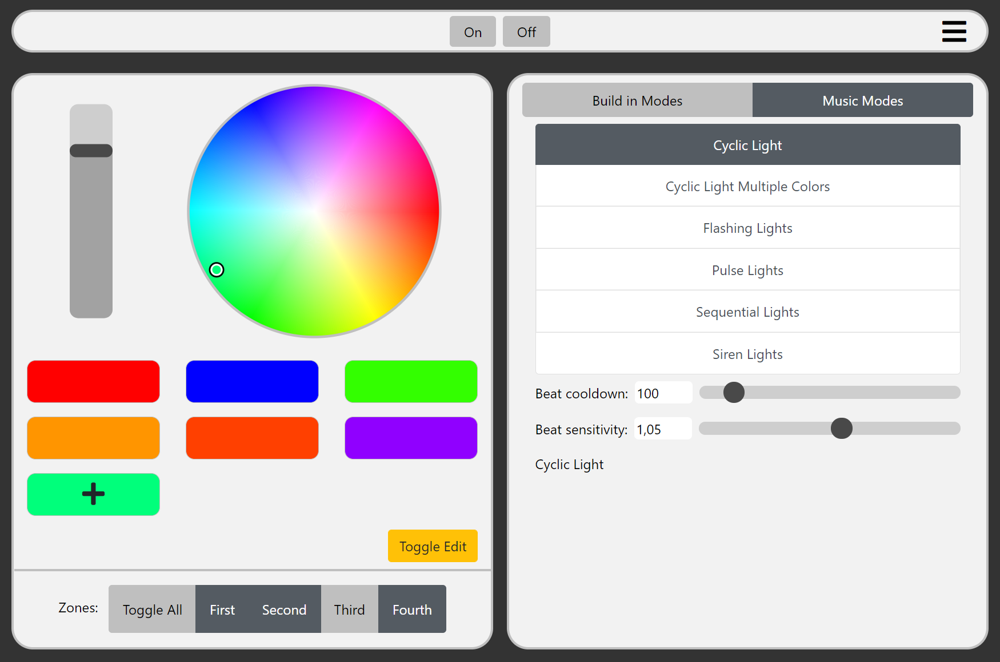

# MiLight-Controller
A comprehensive light controller for the MiLight bridge version 5. 
`MiLight-Controller` _(working name)_ makes it possible to control your MiLight light bulbs and led strips from any device with a web browser.

Simply run the server on a device on your network and connect to it via your browser. 
Your MiLight bridges will already show up, you only need to select one and are ready to go!
To use the build in music controller, go to settings and select an audio stream from the device the server is running on. 

This project is currently in a __beta stage__. Feedback would be greatly appreciated!

# Main Features

- Music visualizer with numerous modes
- Select and save custom colors
- Single and multi zone control
- Build in light Modes
- Automatic Bridge discovery

# Music visualizer

The Music visualizer will listen to the selected audio stream and apply a light effekt every time it detects a beat. 
To fine tune the beat detection you can modify the following settings on the web ui: 

- __Beat cooldown:__ minimum time in milliseconds between beats. 
    A high value can lead to skipped beats while a low value may lead to the same beat being detected twice. 
    Setting this to a higher value reduces load on the network, Bridge and controllers. 
    A good starting point could be between 80-200, but values outside of this range can make sense too.
- __Beat sensitivity:__ changes the general sensitivity of the beat detection algorithm. A lower value will lead to more beats being detected, while a higher value will lead to less _false positives_. 

### General Idea

About 43 times a second the algorithm takes a sample of the current audio output.
In the first step the audio sample gets normalized to avoid the volume of impacting the beat detection.
After that, we compute the _energy_ of the sample. The _energy_ is simply the sum of the absolute values in the buffer.
The _energy_ then gets stored in a buffer, together with the last ast 86 (~2 seconds, this value may not be final) samples energy.
We use this buffer to then calculate the variance of all values in it. This will help to adjust to different styles of music, by dynamically adjusting the threshold. 
The threshold is calculated using the variance, a user set sensitivity as well as a static value.
If the current energy is greater than the threshold, and the last detected beat is at least n milliseconds ago, where n is the user input value for __Beat cooldown__, a beat gets detected. 

This beat detection algorithm is loosely based on the article 
[Beat Detection Algorithms](https://www.gamedev.net/reference/articles/article1952.asp)
by Frédéric Patin.
If you are interested in this topic, a more in depth description and more complex algorithms, I can recommend his article.
Please Note the beat detection algorithm used in this project is not exactly what he describes.

An alternative implementation, better suited for music with a lot of noise, may come in the feature, but the current version already works pretty well.

# Setup

### Prerequisites 

Java 15 and a MiLight Bridge v.5 is required. 
In case you have another MiLight Bridge, feel free to test this and contact me with your results.

### General setup

Download the latest release from the [releases page](https://github.com/aliebald/MiLight-Controller/releases).
After that, you can simply execute `MiLightController.sh` or execute the jar via a terminal of your choice, e.g. under windows: `java -jar '.\MiLight Controller.jar'`.

Your Ip Address as well as the used port will show up in the terminal after the server is started. 

### Setup the music visualizer

To use the music visualizer an audio stream needs to be selected.
To select an audio stream, got to the settings (klick on the 3 bars on the top right -> settings) and select one of the available streams under "Audio input for music visualizer".

If you want to use the output of your pc, you currently need some type of audio loopback. 
If you use Windows, you can use the _Stereomix_ or try the _primary sound recording driver_. 
Otherwise, you can try using a physical audio loopback with e.g. a jack cable.

# Planned Features

- __Ui style revise__
- __More options for Music Modes__
- __More/improved Music Modes__
- __Custom Modes__: Similar modes to the Build in Modes (which are build into the MiLight Controller) but more extensive.
- __Custom scenes:__ Create, customize and apply custom scenes. 
    A scene defines a color, brightness and on/off state for each zone. 
    This way it is possible to quickly change the current light setting in the whole room. 
- __Saturation control__
    - There is currently a problem with the binary code send to the bridge.

# Contact

If you have any suggestions or general feedback, feel free to contact me: 
contact.liebald(at)gmail.com

# License

TODO